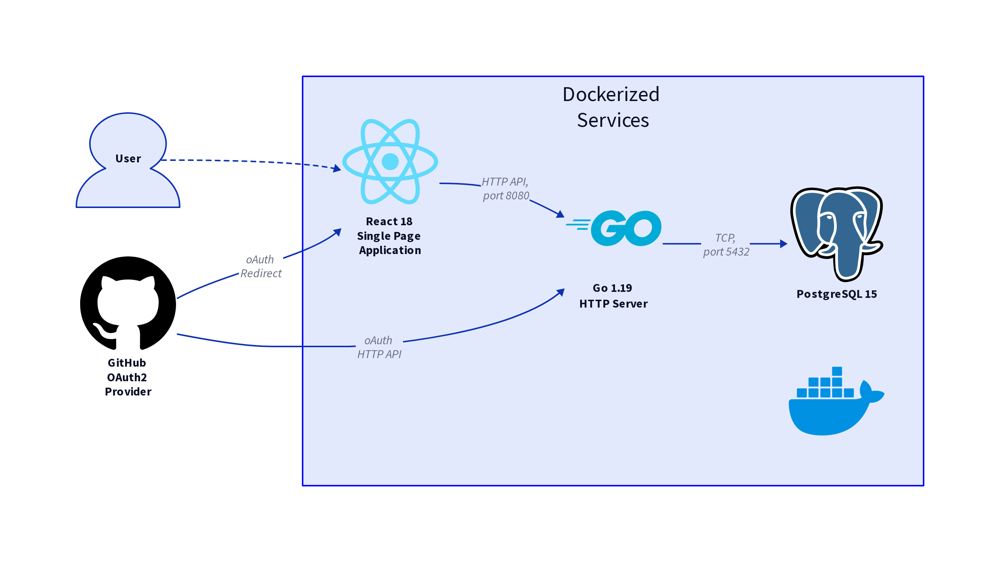
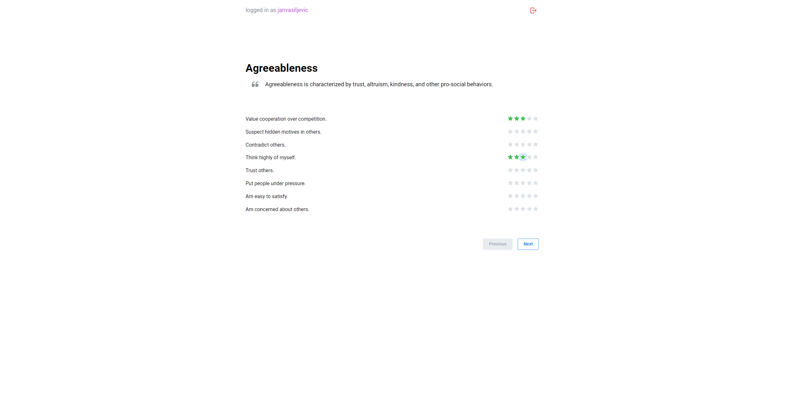
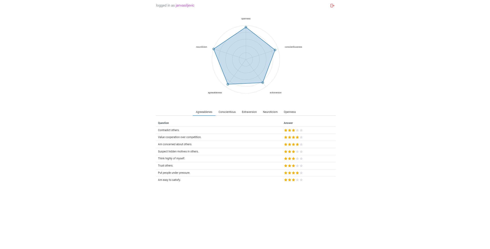
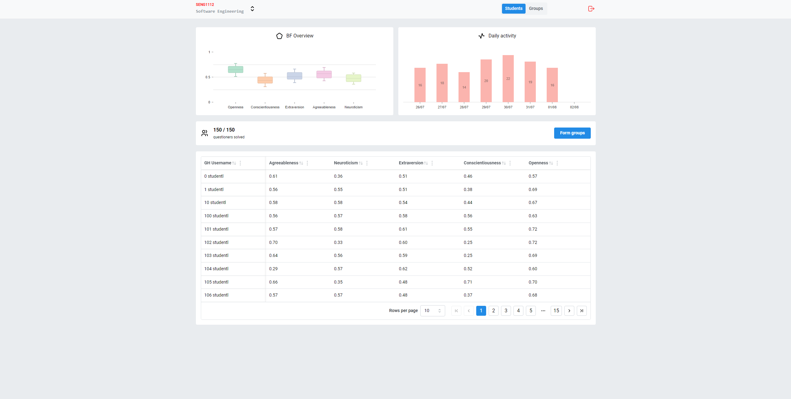
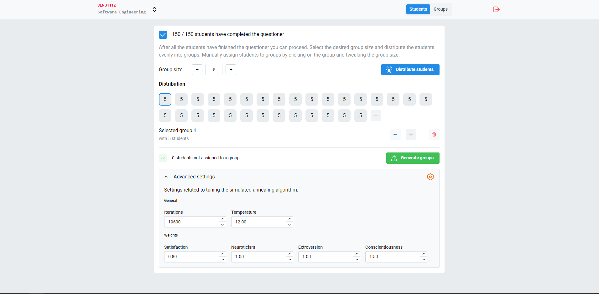
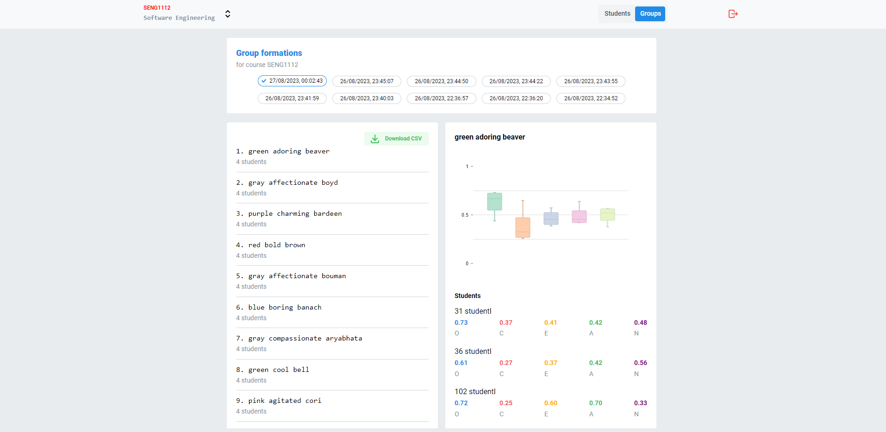

# Team Tone Tuner

## Description

Team Tone Tuner is a web application that helps teachers to create balanced teams for group projects, based on the students' personalities.
This is a proof-of-concept implementation of the framework described in my thesis `Incorporating Psychological Factors into Software Engineering Team Formation`.



## Required software

- [Docker](https://www.docker.com/)
- [docker-compose](https://docs.docker.com/compose/)
- [Node.js](https://nodejs.org/en/)
- [yarn](https://yarnpkg.com/)
- [atlas](https://atlasgo.io/)
- [make](https://www.gnu.org/software/make/)
- [swaggo](https://github.com/swaggo/swag)

Go isn't needed, as it is bundled in the Docker image (including `air` hot reload development server).

## Installation

Configure `.config.toml` in `/env` folder. It follows this structure:

```toml
title = "Development enviroment"

environment = "dev"

[server]
port = 4040

[database]
connectionUrl = "host=ttt-db port=5432 user=dev dbname=dev password=12345678 sslmode=disable"

[github]
clientId = "<your github client id>"
clientSecret = "<your github client secret>"
redirectUrl = "http://localhost:8080/api/login/github/callback"
```

```sh
make yarn
docker-compose up

# in another terminal
make migrations
make seed
```

You can now visit `http://localhost:5173` and login with any GitHub account, to finish the student questioner.


## Folder and file descriptions

Quick overview of the project structure for both the backend and frontend.
### Backend
- `/api` - API controllers with swagger documentation. Also includes business logic
- `/config` - Configuration loader using `viper`
- `/docs` - Auto-generated Swagger documentation
- `/dto` - Data transfer objects used for API requests and responses
- `/env` - Environment files 
- `/model` - Database entities and operations generated using `ent`
- `/resources` - External resources
  - `/migrations` - Database migrations generated using `atlas`
  - `/seed` - Files needed for seeding the database (e. g. questions)
- `/router` - API router and associated middleware like authentication
- `/schema` - Database schema used by `ent` to generate database entities
- `/scripts` - Scripts used for the development and seeding the database
- `/service` - Separated business logic
- `/store` - Database access layer
- `/teamform`- The main Simulated Annealing TF algorithm implementation

### Frontend
- `/src` - Source 
    - `/api` - API client generated using `orval`
    - `/assets` - Static assets e.g. images
    - `/components` - Separated React components
    - `/hooks` - Extracted logic into React hooks
    - `/modals` - Mantine context modals
    - `/pages` - Subpages e.g. login, report, questioner,...
    - `/router` - Definitions for routes and linking them to pages
    - `/store` - Zustand store for persisting global state


## Screenshots







